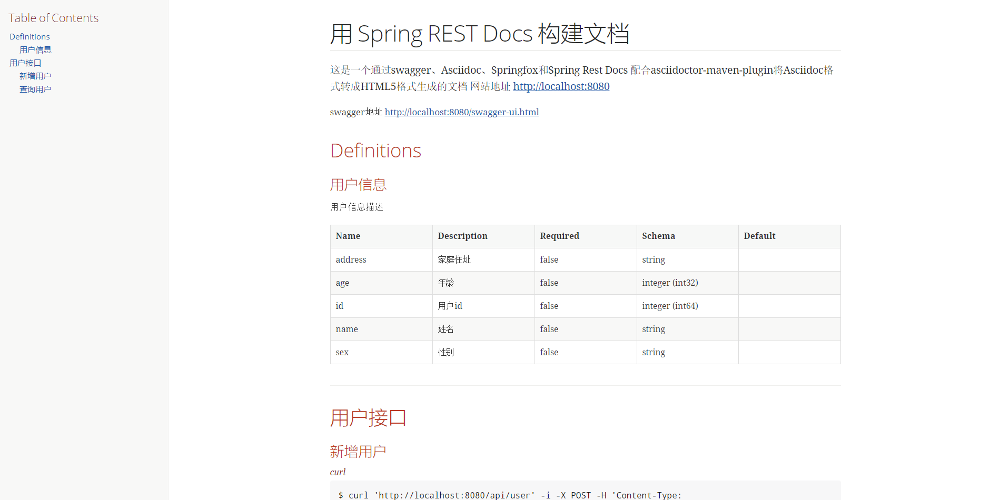

这是一个通过swagger、Asciidoc、Springfox和Spring Rest Docs 配合asciidoctor-maven-plugin将Asciidoc格式转成HTML5格式生成文档的例子

运行效果：

### 使用时需要以下几步：
* 导入 pom依赖
* 配置 swagger
* 使用 swagger注解
* 文档生成类的编写
* 使用 maven 插件 执行打包就可以生成相应的文档

相关细节请参考本示例或官方给出的[示例](https://github.com/asciidoctor/asciidoctor-maven-examples) 